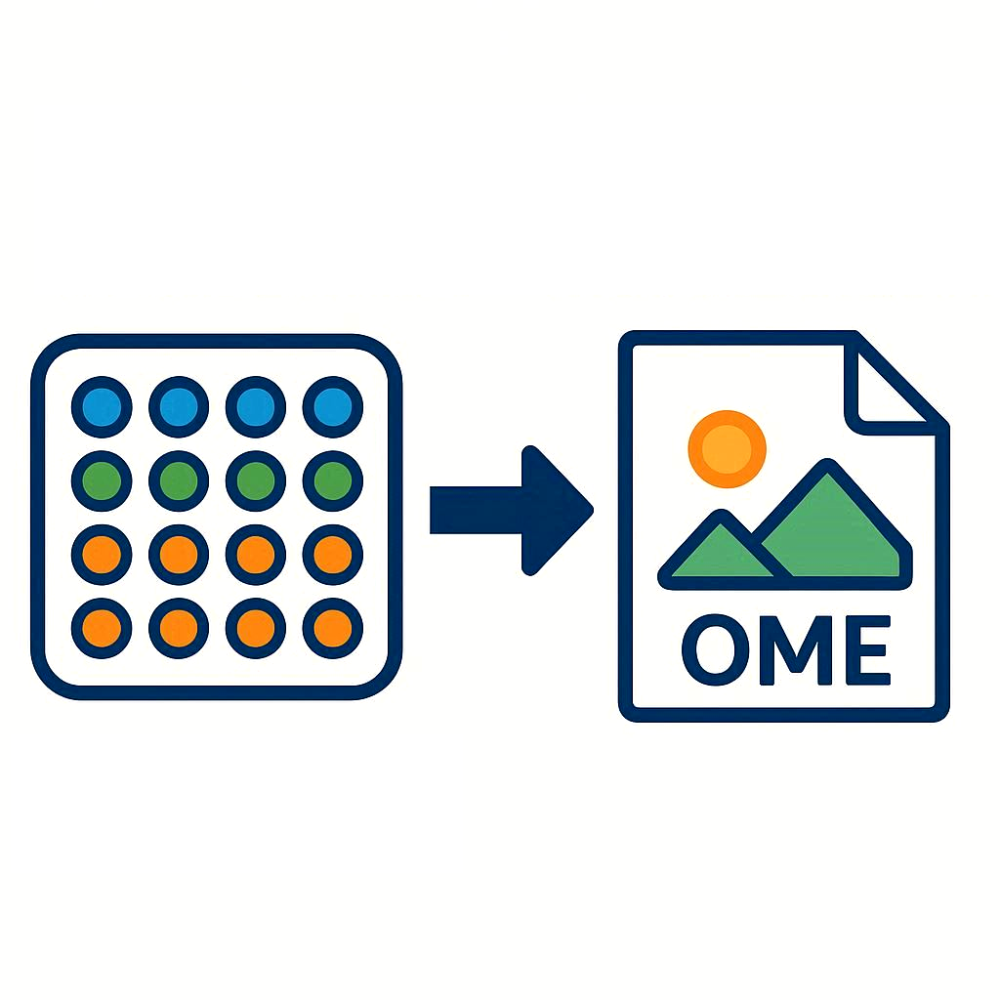

# biomero-converter

Conversion from various formats to Ome-tiff and Ome-zarr

This tool can be used as biomero plugin, Docker container or stand-alone

## Features
- Extract and process image data including bioformats unsupported formats
  - OME-Zarr
  - (OME-) Tiff
  - Thermo Fisher tiff files
  - ImageXpress Pico
  - Molecular Devices
  - CellReporterXpress experiment
  - image db files (.db)
  - isyntax files (.isyntax)
  - Incucyte archives (.icharch)
  - 3DHistech files (.mrxs)
  - DICOM files
  - Leica files (.lif, .lof, .xlef, .xlcf, .xlif)
    - all images in a file, or a single image selected by UUID
    - RGB, multi-channel, Z-stack, time series and tile scans (stitched)
- Export to Ome formats
  - OME-Tiff
  - OME-Zarr
- Supporting
  - (Large) whole slide images
  - Screen Plate Well / High Content Screening format
- Compatible with Omero

## Documentation
### [nl-bioimaging.github.io/biomero-converter](https://nl-bioimaging.github.io/biomero-converter/)
### Generated: [deepwiki.com/NL-BioImaging/biomero-converter](https://deepwiki.com/NL-BioImaging/biomero-converter)

