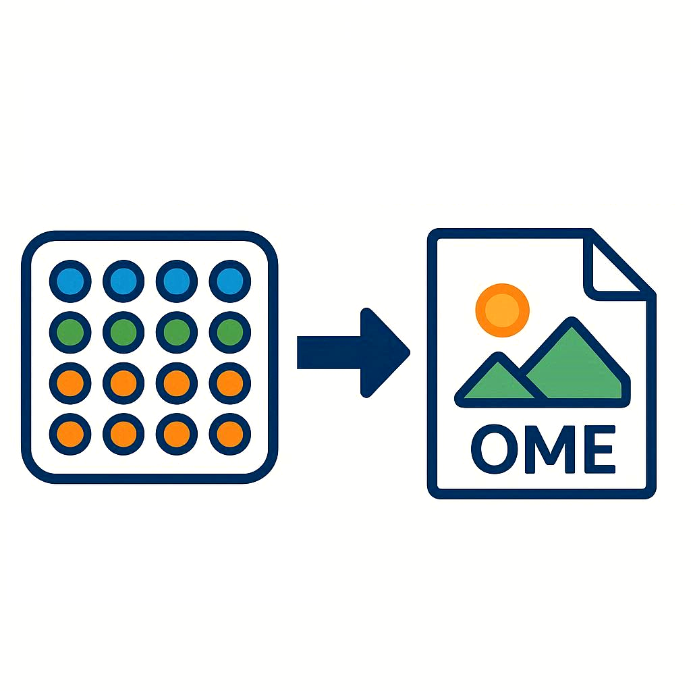

# image-db-to-ome
- Extract and process image data from ImageXpress Pico, Molecular Devices, CellReporterXpress experiment and image db files
- Export to ome-tiff and ome-zarr supporting Screen Plate Well / High Content Screening format
