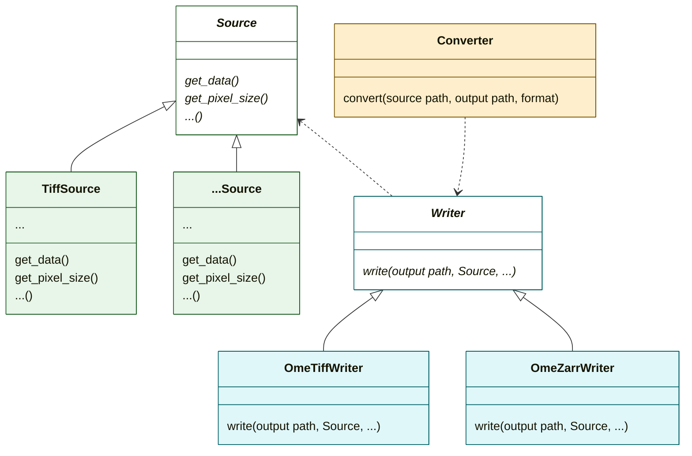

# Converter Overview

This project provides a converter that transforms source image data into OME-Tiff or OME-Zarr format.
When creating a github release, a Docker image is built and published to Docker Hub with corresponding version tags
[here](https://hub.docker.com/r/cellularimagingcf/biomero-converter).

## Architecture

The converter workflow consists of:

- Creating a **Source** reader to access image data and metadata.
- Creating a **Writer** to generate OME output.
- The **Writer** queries the **Source** for metadata and data, then writes the output.

